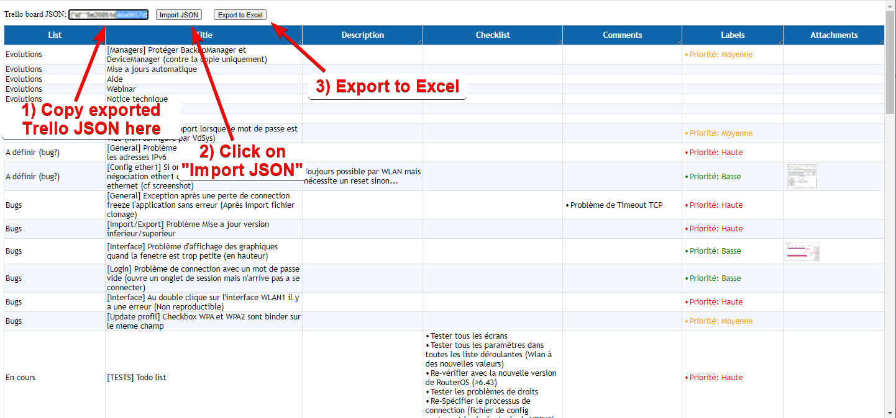

# TrelloJsonToHtmlTable

Convert a Trello board (exported as JSON) to an HTML table.
An export button then allow to export to Excel (xls)

## How to use

First port your board from Trello:

Then copy and paste the `JSON` in `TrelloJsonToTable.html`
Now open the page, you should see something like this:

You can then export to excel with the top button!

Feel free to contribute (design, columns, interactions, ...)
